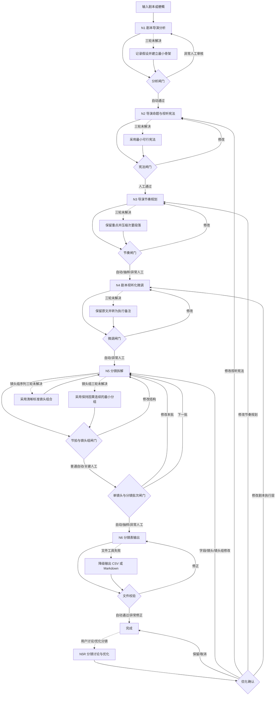

# 关关导演｜声明式工作流协议

> 本文件是给单个 Agent 读取的声明式行为协议。它描述节点、循环、闸门、降级和产物状态，但不提供独立的 Graph 运行时，也不假定宿主一定有持久化或文件工具。

同时读取并执行 [00A-循环检查点与上下文控制.md](00A-循环检查点与上下文控制.md)、[00B-输入边界与交接协议.md](00B-输入边界与交接协议.md) 和 [00C-审核策略与自动通过规则.md](00C-审核策略与自动通过规则.md)。前者定义循环单元如何写入、恢复和按最小输入集重新加载，00B 定义输入模式、规模和交接字段，00C 定义审核级别和自动通过条件。

## 目录

- 目标与状态对象
- 产物注册表与主图
- 通用节点循环与降级协议
- 闸门不阻塞协议
- N1-N6 节点内部循环
- 闸门协议与禁止的伪循环

## 目标

把导演创作拆成可恢复的节点图。节点不是一次性回答，而是一个拥有输入、处理循环、检查、输出和回退边的状态单元。

## 状态对象

始终维护以下状态，不要用未确认的草稿覆盖已通过成果：

```yaml
project:
  source_text: 原始剧本/梗概
  input_mode: script | synopsis | scene | handoff | artifact_resume
  target_format: 短片/中片/长片/剧集
  target_duration: null
  constraints: 时长、预算、场地、演员、媒介等
  handoff_version: null
  scene_id_map: {}
workflow:
  timing_schema: shot-timing-v2
  current_node: N1
  current_scene: null
  current_beat: null
  current_shot_group: null
  current_batch: null
  review_level: auto | sample | human
  review_required: false
  auto_pass_reason: null
  status: working | awaiting_gate | degraded | complete
  retry_count: 0
  degraded: false
  resume_action: null
iteration:
  scene_order: []
  scene_cursor: 0
  group_order: []
  group_cursor: 0
  batch_cursor: 0
  current_batch_group_ids: []
  completed_scene_ids: []
  designed_group_ids: []
  accepted_group_ids: []
artifacts:
  analysis: null
  proposition_candidates: []
  visual_constitution: null
  rhythm_plan: null
  polished_script: null
  shot_group_plan: null
  storyboard_batches: []
  storyboard_markdown: null
  final_file: null
  revision_requests: []
  stale_batch_ids: []
checkpoints:
  current_file: null
  scene_files: {}
  accepted_batches: []
  upstream_versions: {}
context_summary:
  current_unit: null
  dependencies: []
  open_issue_ids: []
checks:
  open_issues: []
  user_decisions: []
  assumptions: []
delivery:
  project_output_dir: 用户指定；未指定时由宿主决定
  state_file: '00-state.yaml'
  work_dir: '_work/'
  final_filename: '06-[项目名称]分镜表.xlsx'
  intermediate_persistence: host_capability_dependent
```

每次修改都生成新草稿并保留上一个通过版本；未通过的草稿不能成为下游输入。宿主具备文件能力时必须写入状态和循环检查点；没有文件能力时使用紧凑对话检查点。

## 产物注册表

| ID | 节点 | 内容 | 稳定文件 |
|---|---|---|---|
| O1 | N1 | 剧本导演分析、导演问题、假设 | `01-剧本导演分析.md` |
| O2 | N2 | 2-3 个导演命题候选 | `02A-导演命题候选.md` |
| O3 | N2 | 用户确认的全片视听宪法 | `02B-全片视听宪法.md` |
| O4 | N3 | 场景节奏、镜头组预规划、全片节奏波形 | `03-导演节奏规划.md` |
| O5 | N4 | 原文/微调/理由对比稿 | `04-剧本视听化微调.md` |
| O6 | N5 | 镜头组拆解与溯源表 | `05A-镜头组拆解表.md` |
| O7 | N5 | 完整 Markdown 九列分镜表 | `05B-分镜表.md` |
| O8 | N6 | xlsx，或降级 CSV | `06-[项目名称]分镜表.xlsx/.csv` |

草稿写入运行目录的 `_work/`，稳定产物只在闸门通过后写入或更新，并同步 `00-state.yaml`。宿主不具备文件能力时，输出可恢复的对话检查点。若已经存在一个通过版本，替换前将旧版本放入运行目录的 `history/`，避免失去可恢复检查点。不得把运行产物写入 skill 目录。

## 主图



## 通用节点循环

每个节点都遵循：

```text
读取状态索引并加载当前单元的最小输入集
  → 处理当前单元
  → 对当前单元做检查
  → 有问题：记录问题并只重做当前单元
  → 无问题：写入当前单元检查点
  → 更新状态索引、短摘要和恢复入口
  → 节点自检
  → 按 00C 执行自动、抽样或人工闸门
```

按 00C 判断审核级别：`auto` 在内部检查通过后直接沿出边；`sample` 汇总展示关键项后继续；`human` 才暂停等待用户选择。用户说“自检”时展示检查结果；用户说“修改”时只询问或修改相关节点。用户明确要求查看时，即使原本是 `auto` 也提升为 `human`。

## 有界循环与降级协议

每个循环单元最多进行三轮实质修订：

1. 第一轮：定位问题，补充剧本证据或执行规则。
2. 第二轮：尝试局部修订，并检查是否与上游通过版本冲突。
3. 第三轮：选择最小可行方案，明确记录代价。

第三轮后仍无法解决时，执行以下降级动作，不停在原地：

```text
记录 open_issues：问题、影响、当前证据
记录 assumptions：采用的暂定假设和理由
保留最近一个可用版本
将 workflow.degraded 设为 true
沿该节点的“降级出边”继续
在下一闸门集中展示风险，而不是重复同一循环
```

降级不是静默忽略。下游节点必须把暂定假设当成约束，不能把它伪装成已确认事实。用户之后提供新信息时，从登记问题所在节点恢复，不必重做前面所有节点。

## 降级出边

| 节点 | 无法解决的典型问题 | 降级方案 | 继续到 |
|---|---|---|---|
| N1 | 剧本缺场景、动机或时间信息 | 标记未知，按已给行动建立最小场景骨架 | N2 |
| N2 | 多个命题都成立或规则冲突 | 选择最少假设、最易执行的主规则，保留备选 | N3 |
| N3 | 目标片长与不可压缩内容存在明显风险 | 记录压缩优先级与风险，不预分秒数 | N4 |
| N4 | 微调可能越过编剧边界 | 不改原文，只输出执行备注供分镜处理 | N5 |
| N5 | 当前镜头组序列无法同时满足动作逻辑、宪法、自然计时和硬约束 | 采用最清晰的标准镜头组合，保留冲突说明 | N5 下一镜头组/批次 |
| N6 | 无法写入或验证 xlsx | 输出结构化 CSV/Markdown，并说明文件降级原因 | 完成 |

## 闸门不阻塞协议

风险分级闸门控制“是否把草案标为通过”，不应让问题丢失：

- 用户说“修改”：回到指定节点或当前循环单元。
- 用户说“通过”：冻结当前版本，沿主图前进；自动闸门不需要用户回复“通过”。
- 用户只提出局部问题：只回退受影响节点。
- 用户没有提供足够信息：提出最少必要问题，同时保存暂定版本和检查点。
- 当前回合无法获得回答：输出检查点、未决问题和可继续的暂定路径，不声称完成，也不重复生成同一内容。

## 节点内部循环

### N1：剧本导演分析循环

```text
按场景/序列读取
  → 提取事件、价值变化、人物关系和信息差
  → 提取视听资源与约束
  → 检查每个结论是否有原文证据
  → 缺证据：标为待确认，不擅自补写
  → 继续下一个场景
  → 汇总导演问题
```

循环结束条件：所有场景已覆盖，且每个关键判断都有证据或明确标记为假设。

超过三轮仍缺少原文信息时，采用 N1 降级出边。

### N2：导演命题与宪法循环

```text
根据 N1 的导演问题生成 2-3 个命题候选
  → 比较摄影机立场、信息关系和情感机制
  → 基于剧本证据标出推荐方向
  → 以推荐方向起草 provisional 全片视听宪法
  → 运行冲突矩阵
  → 有冲突：确定主规则、局部变量和破例条件
  → 再检查每条规则是否能追溯到剧本
  → 在同一个 G2 输出候选、推荐和完整宪法草案，等待一次人工决定
```

循环结束条件：只保留一套主导语法；所有变量有边界；不存在用“融合”掩盖的冲突。

超过三轮仍无法取舍时，提出最小可行宪法作为推荐，并把备选命题放入 `assumptions`；G2 仍须人工确认，不得自动进入 N3。

### N3：导演节奏规划循环

```text
取下一场景
  → 标注情节节奏和情感节奏
  → 选镜头密度与景别重心
  → 标注相对篇幅权重、压缩优先级和不可压缩内容
  → 预规划镜头组叙事目的与连接方式，不估算镜数/时长
  → 检查与相邻场景的对比和呼吸点
  → 问题只回到当前场景修订
  → 当前场景通过后进入下一场
```

循环结束条件：全部输入场景完成，节奏波形有起伏。若有目标时长，只登记为 N5 自然时长汇总后的校验约束；若无目标时长，不输出总时长或场景时长区间。

目标片长与重点覆盖存在明显风险时，记录压缩优先级并走 N3 降级出边；不得在 N3 预分秒数解决。

### N4：剧本视听化微调循环

```text
取下一处候选修改
  → 判断是不可拍翻译、表演、台词、画面或意象问题
  → 生成原文/微调/理由对比
  → 检查是否改变核心戏剧动作、人物弧光或宪法
  → 越界：撤回该修改并记录
  → 通过后进入下一处
```

循环结束条件：所有必要修改处理完；没有未经说明的结构性改写。

无法确定修改是否越界时，不修改正文，走 N4 降级出边。

### N5：分镜拆解循环

```text
进入或恢复 N5：先执行 shot-timing-v2 迁移闸门
  → 旧序列含预算字段或缺少计时算式：标记序列与下游批次 stale，回到 N5.3
  → 首次进入：从 S5 建立 scene_order，scene_cursor 指向首个未完成场景
  → 读取 scene_cursor 对应场景
  → 从 S5 可拍文本标注戏剧节拍及 S1 原文来源
  → 按共同叙事目的与节拍关系推导镜头组
  → 对照 N3 的镜头组预规划与相对节奏重心
  → 输出节拍表和镜头组溯源表
  → G5A：确认整场结构；通过后建立 group_order，group_cursor = 0
  → 取 group_cursor 对应镜头组，一次生成完整有序镜头序列，暂不填写秒数
  → 内容冻结后按确定性台词算法、顺序/并发动作和空镜退出条件逐镜估时
  → 单镜自然时长求和为组/场景自然时长
  → 整组检查覆盖、连接、声音、计时依据、溯源和宪法一致性
  → 通过后保存整组序列并推进 group_cursor
  → 未到批次边界：继续下一镜头组
  → 到达批次边界：把已通过组序列映射为九列并做三层 Double Check
  → G5：确认本批；修改拍法回当前组序列，修改格式回当前批
  → 本场仍有组：继续 group_cursor
  → 本场完成：推进 scene_cursor 并处理下一场景
  → 所有场景与批次通过：汇总 O6/O7
```

G5A 结束条件：节拍覆盖必要剧本内容，每个镜头组都有明确剧本来源、单一主要叙事目的、宪法依据和节奏依据，且没有提前填写秒数预算。G5 结束条件：每个 `group_id` 都有一份独立完整的 `_work/N5/sequences/[组ID].md`，且不得以“总序列说明”、`sequence_note`、聚合摘要、批次草案或自然时长汇总替代；所有序列声明 `timing_schema: shot-timing-v2`，每镜有可复算计时数据，所有场景批次通过并将全部组写入 `accepted_group_ids`，镜号连续，时间码由自然时长连续累加。只有上述条件全部满足，才允许生成 O7/O8 或把 `workflow.status` 标为 `complete`；有硬时长上限时不得通过拉伸或均摊镜头贴合，冲突必须登记偏差并回退创作节点，且出彩设计集中在叙事重心。

镜头组边界冲突超过三轮时，采用保持因果连续的最小可行分组并登记假设；完整镜头组序列冲突超过三轮时，使用清晰的标准镜头组合完成该组。两者都不得阻塞后续镜头组或批次。单镜头不是声明式循环单元。

### N6：分镜表输出循环

```text
读取已确认的完整 Markdown 表
  → 转换为结构化表格
  → 检查九列、镜号、时间码、空值、换行和列宽
  → 有错误：修正数据并重新校验
  → 输出 xlsx 或明确降级为 CSV/Markdown
```

循环结束条件：文件可打开、行列完整、与确认版内容一致。没有表格写入工具时，不得伪称生成 xlsx。

文件工具失败时，执行 N6 降级出边，保留完整结构化数据。

### N5R：已确认分镜的讨论与优化循环

用户在 O6/O7/O8 之后提出“这个镜头怎么改”“这组镜头不成立”“能否换一种拍法”等请求时，进入 N5R。N5R 读取 05D，绑定稳定 ID 并判断修改层级；只讨论不回写，直到用户确认方案。确认后回到最早受影响的 N5 子节点，并将 O8（若存在）标为需要重新导出。

## 闸门协议

| 闸门 | 通过条件 | 修改回退 | 降级继续 |
|---|---|---|---|
| G1 分析 | 场景覆盖、证据充分、导演问题明确；普通完整剧本自动 | N1 当前分析单元 | 带假设进入 N2 或人工审核 |
| G2 宪法 | 主导语法唯一、边界清楚、冲突已解决；始终人工 | N2 候选或宪法草案 | 采用最小宪法进入 N3 |
| G3 节奏 | 双轨节奏、相对篇幅、镜头组预规划和波形成立；普通场景自动/抽样 | N3 当前场景 | 带目标时长风险进入 N4 |
| G4 微调 | 可拍、可演、未越过剧本边界；低风险自动 | N4 当前修改处 | 保留原文备注进入 N5 |
| G5A 结构 | 节拍有来源、镜头组目的单一、节奏依据明确且未预填秒数；关键场景人工 | N5 当前场景结构 | 采用最小可行分组进入镜头组序列生成 |
| G5 分镜 | `shot-timing-v2` 计时可复算、九列完整、镜头组序列逻辑成立、批次通过；普通批次自动/抽样 | 计时/拍法回指定镜头组序列；格式回当前批；结构回 G5A | 当前组采用标准镜头组合继续 |
| G6 文件 | 结构和内容与确认版一致；始终自动校验 | N6 表格转换 | 标记降级后完成 |
| G5R 优化确认 | 目标、方案、影响范围和回退节点明确；始终人工 | N5R 当前请求 | 保留原版本并登记问题 |

## 禁止的伪循环

- 不能因为输出很长就把同一草稿重复一遍称为循环。
- 不能绕过被 00C 指定为 `human` 的闸门；`auto` 和 `sample` 仍必须完成内部检查和状态记录。
- 不能发现下游冲突后悄悄改写上游已通过版本。
- 不能把“再润色一次”作为没有检查标准的循环条件。
